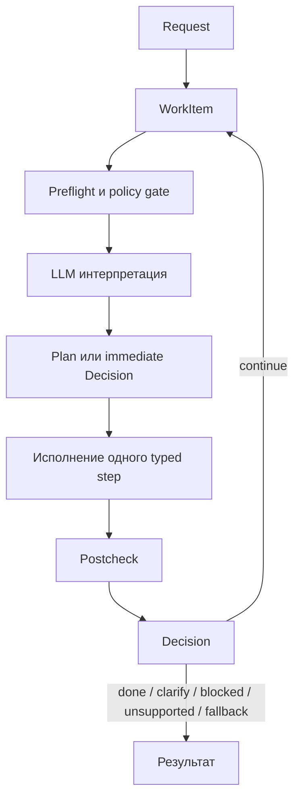

# pac1-py-domain-fit

Экспериментальный PAC1-агент с архитектурой, в которой LLM отвечает в основном за интерпретацию, а детерминированный код — за правила, исполнение и безопасность.

## Основные принципы

Проект опирается на следующие принципы:

- LLM интерпретирует, но не владеет canonical truth.
- Canonical truth берётся из workspace-данных и детерминированных правил.
- Безопасность должна fail-close.
- Typed execution важнее свободной planner-импровизации.
- Multi-step execution допускается только как явный и контролируемый path.

Если коротко:

- LLM должен интерпретировать;
- код должен решать и исполнять.

## Верхнеуровневая архитектура

Снаружи runtime читается через четыре понятия:

- `Request`
- `WorkItem`
- `Plan`
- `Decision`

Упрощённый цикл:



`continue` и `fallback` здесь различаются:

- `continue` — это typed следующий шаг внутри контролируемого execution loop;
- `fallback` — это явный переход в более слабый режим, когда детерминированного покрытия не хватает.

### Слои


Основные каталоги:

- `domain/`
  Канонические модели, value objects, инварианты, политики, проекции.
- `application/`
  Typed queries, mutations, workflow steps, use-case orchestration, порты.
- `runtime/`
  Wiring, context loading, VM integration, public-machine execution.
- `task_routing/`
  Typed extraction, disclosure, selectors и LLM-facing adapters.
- `loaders/`
  Загрузка markdown / JSON / workspace surface в typed records.

## Где используется LLM

LLM применяется в ограниченных местах:

- `RouteDisclosure`;
- typed extraction;
- inbox/workflow classification;
- closed-set selection при недостаточном deterministic exact match;
- узкий re-extraction / fallback.

LLM не должен:

- создавать canonical truth;
- заменять собой domain invariants;
- обходить policy boundaries;
- превращаться в скрытый planner, который решает всё сам.

## Где используется детерминированный код

Детерминированный слой владеет:

- canonical identity и references;
- workspace semantics;
- finance mutation invariants;
- authorization и safety gates;
- deterministic query execution;
- controlled workflow continuation;
- postconditions и terminal outcomes.

## Domain modeling

В проекте есть элементы DDD и классических backend-паттернов:

- bounded contexts;
- rich entity и value objects;
- typed projections;
- identity surfaces;
- explicit mutation/query contracts;
- policy objects и bounded selectors.

На практике наибольшую пользу дали:

- проекции;
- поиски и selectors;
- форматтеры;
- typed contracts.

### Пример: finance

Finance-модель включает:

- `FinanceRecord`;
- `FinanceRecordAggregate`;
- `LineItem`;
- settlement metadata;
- typed payment state / settlement channel;
- mutation path с инвариантами.

Например, aggregate поддерживает:

- `add_line_item`
- `replace_line_items`
- `remove_line_item_at`
- `adjust_total`
- `attach_settlement_evidence`
- `mark_settled`

И проверяет, например:

- total должен совпадать с суммой line items;
- total нельзя менять напрямую, если есть canonical line items;
- settlement evidence не должно быть неполным.

## Результат эксперимента

На текущем benchmark runtime доходил до диапазона порядка `102–104 / 104` на `gpt-5.4-mini`. На текущем состоянии ветки был достигнут полный score на полном prod run.

Это не означает, что:

- архитектура завершена;
- lexical debt отсутствует;
- подход автоматически оправдан для любой задачи.

Что этот результат показывает:

- часть agent behavior можно сделать заметно более предсказуемой;
- deterministic execution и typed contracts дают лучшую прозрачность при разборе ошибок;
- скрытая бизнес-логика становится виднее.

## Как запускать

### 1. Подготовка окружения

```bash
uv sync
```

В репозитории уже лежат vendored BitGN SDK stubs, поэтому локальный bootstrap не зависит от внешнего private package index.

### 2. Обязательные переменные окружения

```bash
export BITGN_API_KEY="<your-bitgn-api-key>"
export PAC1_LLM_API_KEY="<your-llm-api-key>"
```

Минимально нужны:

- `BITGN_API_KEY` для доступа к benchmark API;
- `PAC1_LLM_API_KEY` для LLM provider.

Опционально можно переопределять:

- `MODEL_ID` (по умолчанию `gpt-5.4-mini`);
- `BENCH_ID` (по умолчанию `bitgn/pac1-dev`);
- `PAC1_MAX_WORKERS`;
- `PAC1_RUN_LABEL`;
- `BITGN_HOST`;
- `PAC1_LLM_PROVIDER`, `PAC1_LLM_TRANSPORT`, `PAC1_LLM_BASE_URL`.

### 3. Полный prod benchmark

```bash
BENCH_ID=bitgn/pac1-prod \
MODEL_ID=gpt-5.4-mini \
PAC1_MAX_WORKERS=104 \
PAC1_RUN_LABEL="full-prod" \
./.venv/bin/python main.py
```

Замечания:

- для quoted prod scores здесь используется `PAC1_MAX_WORKERS=104`;
- основной prod-моделью считается `gpt-5.4-mini`;
- артефакты каждого прогона пишутся в `.artifacts/run-pac1-prod-main-<timestamp>/`.

### 4. Запуск одной задачи

```bash
BENCH_ID=bitgn/pac1-prod \
MODEL_ID=gpt-5.4-mini \
PAC1_MAX_WORKERS=4 \
PAC1_RUN_LABEL="targeted-run" \
./.venv/bin/python main.py t047
```

Меньший worker count здесь нужен только для локального разбора.

## Где смотреть код

Если нужно быстро понять проект, разумный порядок такой:

1. `main.py`
2. `runtime/orchestration/orchestrator.py`
3. `runtime/context/context_assembly.py`
4. `application/context.py`
5. `domain/process/plan.py`
6. `domain/finance/aggregate.py`

Если интересует только LLM-boundary:

1. `task_routing/disclosure.py`
2. `task_routing/extractor.py`
3. `task_routing/openai_gateway.py`

Если интересует поведение на benchmark, артефакты прогона всё так же пишутся в `.artifacts/run-.../`.


